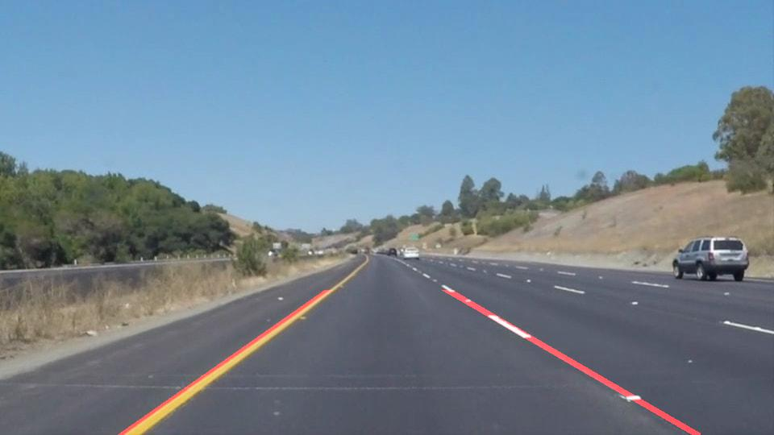

# **Finding Lane Lines on the Road** 

## Writeup Template

---

**Finding Lane Lines on the Road**

The goals / steps of this project are the following:
* Make a pipeline that finds lane lines on the road
* Reflect on your work in a written report

---

### Reflection

### 1. Describe your pipeline. As part of the description, explain how you modified the draw_lines() function.

* My main pipeline (function `detect_lines_from_image()`) goes through the following stages:
    * Convert the image into Grayscale
    * Apply Gaussian smoothing
    * Apply Canny edge detection
    * Apply region of interest mask
    * Apply Hough line detection
* Parameters are tuned manually by iterating on test images.
* In order to draw full length, orderly lane lines, additionally I modified the `draw_lines()` function (named `draw_lines2()`) in the following way:
    * Collect the slopes of all the detected Hough lines.
    * Compute the 20 percentile of slopes, treat it as the cluster center of the left lane line. Compute the 80 percentile of slopes, treat it as the cluster center of the right lane line.
    * Classify detected lines into the left or right cluster based on whether their slope is closer to the 20p of all slopes or the 80p.
    * Prune each cluster by removing the 25% of lines whose slopes are furthest away from the cluster center.
    * Update the cluster centers to the average of slopes of lines that remain in the cluster. 
    * (The above procedure is similar to running the KNN clustering algorithm for one iteration by hand)
    * The left cluster center is the slope of the left lane line; similarly for the right.
    * Compute the intercepts. Draw full length lane lines.
    * Apply region of interest mask to the lane lines drawn.
* Here are some examples:

solidYellowCurve.jpg:

solidWhiteRight.jpg

### 2. Identify potential shortcomings with your current pipeline

* One shortcoming of the current pipeline is that when applied on videos, the detected lane lines are not always stable. Sometimes spurious lines are detected and drawn.

### 3. Suggest possible improvements to your pipeline

* In the near term, we might be able to address the issue above by more carefully tuning the parameters in the pipeline.
* Further down the road, it might make sense to move from hand tuning to a machine learnined regime and apply techniques there (e.g. regularization) to ensure that the output is robust.
